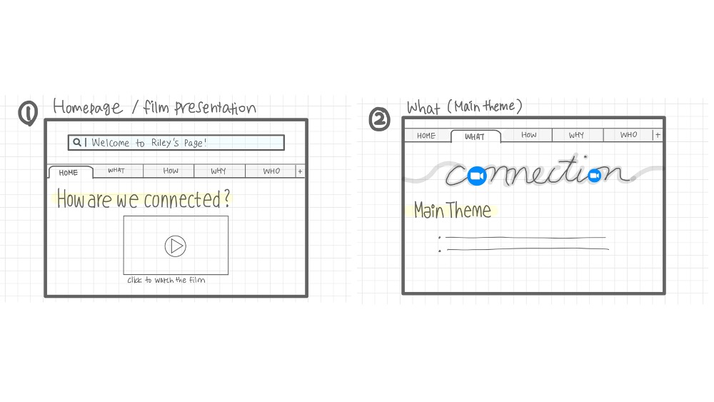
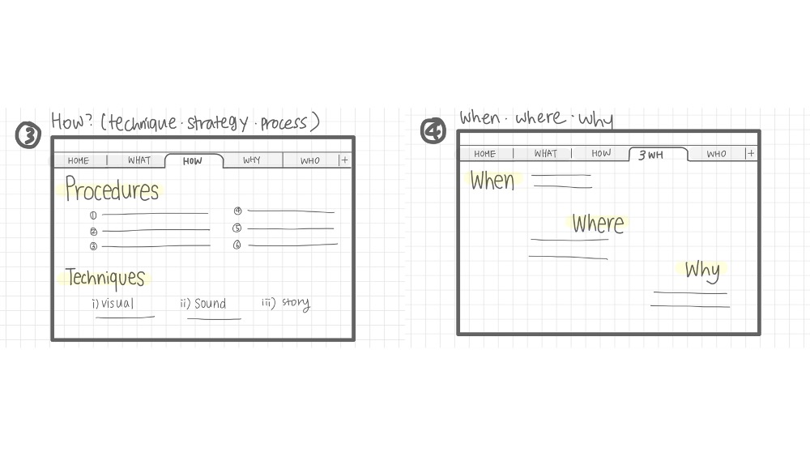
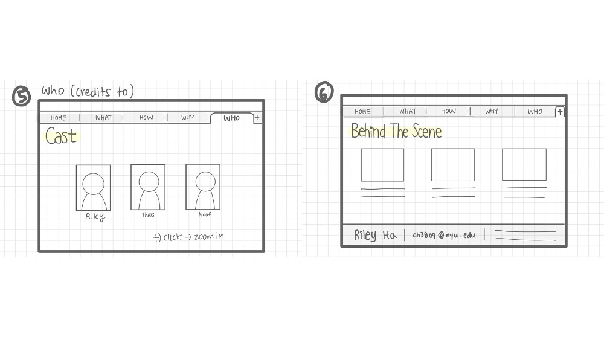

## Assignment 1 - Website ##

## Sep 7th  

### Wireframe

**Below are the hand-drawn images :**

### Story / Title

I chose the title as "How Are We Connected?"
The main theme of the film was to show any form of connection, and our team acheived the goal by showing our connection even in online conditions.
My website will be mainly featuring the 5W1Hs - who, what, when, where, why, and how (but not in this exact order).

### Page 1
This is the main homepage for the website. There will be a big logo on the top that depicts something like "Welcome to Riley's Page".
I will present the film (enable 'click to watch the film').

### Page 2
This page will show the main theme and how our film is delivering the theme.
I added the main theme (connection) in the upper part with zoom logos for the Os to show this in a more delicate way. 

### Page 3
I will discuss Hows (the procedures, the techniques, and the strategies) in this page.
For example, I will divide the section of techniques into three parts of visual, sound, and story.

### Page 4
This page will show when, where, and why, and will be titled as 3W.

### Page 5
This page will hold the bio of the casts (Who - credits to).
I wish to add an interactive element that enables users to manually click the profile pictures to show further description and details.

### Page 6
This page will probably show the Behind the Scene (BTS). 
I will highlight some anecdotes during the making of the film.
The bottom of the website will also have a darker part containing my contact and my name.

### Q. Connection with connection?
A. I wish to create a theme of 'website inside a website'. I believe this will highlight our main theme of connection within online environment.
This will not only reflect the theme and the story but also the current status quo of pandemic.

### Q. Design / Font / Colors?
A. Still more to think about, but the main colors will be the colors that I like.

### Q. Interactive Effect?
A. Changing the slides when clicking (like a 'tab' on the website), clicking the casts' profile, changing the colors using a panel, etc.

### Q. How will I show the viewer that they have reached the end of the screen?
A. Darker part at the bottom of the screen that shows my name and my contact + bumping sound (windows error sound) + maybe blank letters filling up when scrolling?
