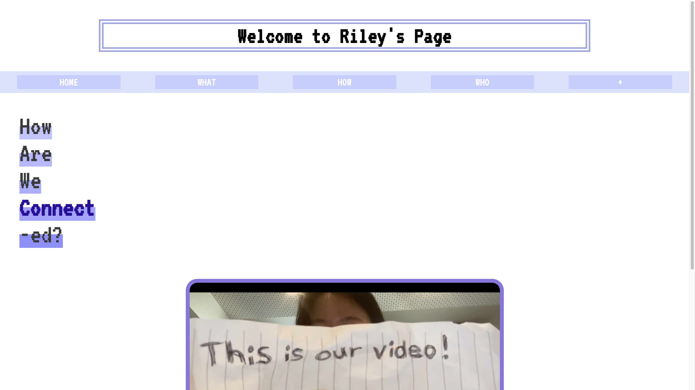
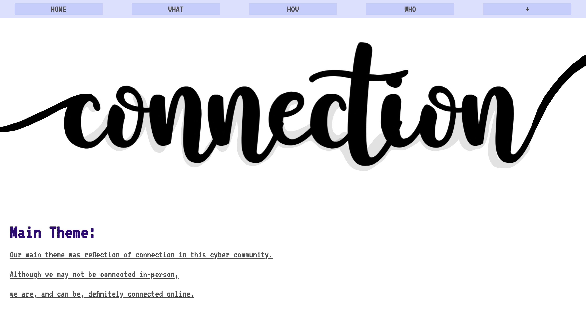
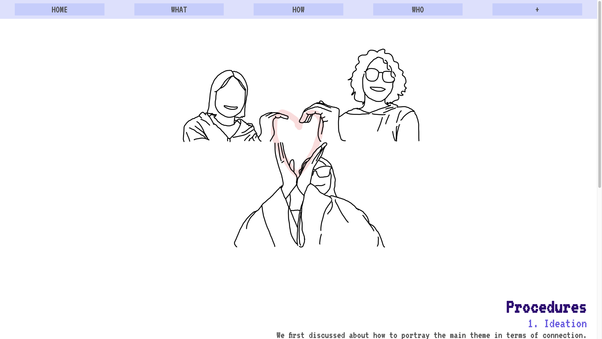
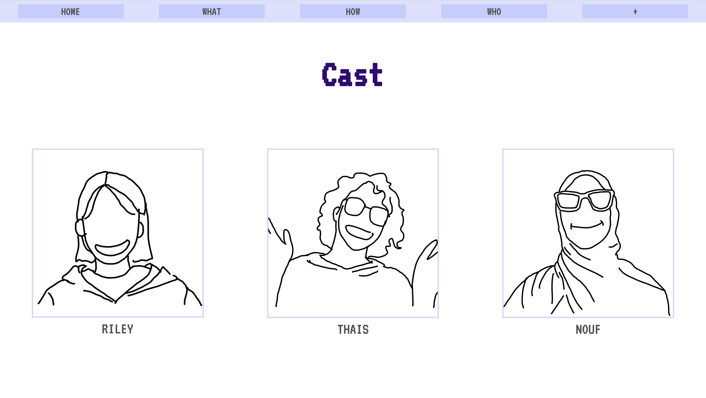
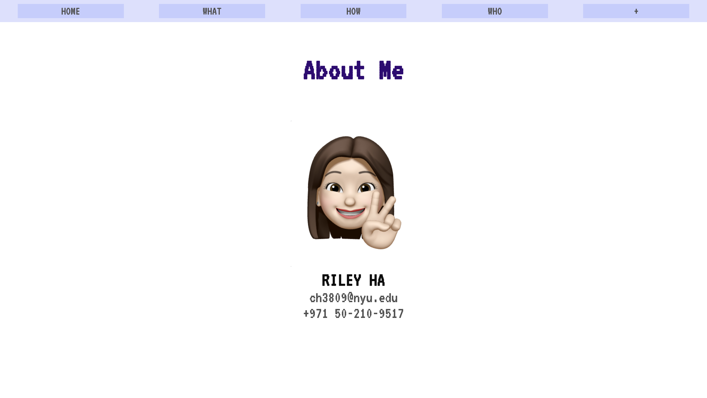

## Assignment 1 - Website: How Are We Connected? ##

## Sep 23rd

### Story / Title

I chose the title as "How Are We Connected?"
The main theme of the film was to show any form of connection, and our team acheived the goal by showing our connection even in online conditions.
My website originally aimed to feature the 5W1Hs - who, what, when, where, why, and how (but not in this exact order), and ultimately featured who, what, how.

### Page 1; Main homepage
I used header to make a huge logo of welcoming.
Underneath the buttons that leads to other pages, I used the paragraph (
) and break ( ) to create a line-by-line effect.
I used video source to showcase the 30MFF film; I aimed to increase the availability for the users by enabling the control button.

### Page 2; What
This is the page that portrays the main theme - connection. This page also depicts how our 30MFF film is delivering the theme.
The huge illustration at the top (with each end 'connected' to the end of the website)
enables the audience to take a quick glance at the whole theme.

### Page 3; How
I discussed the Hows (detailed procedures and techniques) in this page.
I added simple illustration of the highlight of the film - the heart.
  

### Page 4; Who
This page holds the bio of the casts (Who - credits to).
For the protection of portrait rights (XD), I used illustrations of each actors.
I used division to arrange the images side by side.
  

### Page 5; +
This page was used as the additional information section, mainly the profile of myself.
I added my own mimoji and my contacts.

### Q. Reflection & Evaluation?
A. I actually enjoyed the whole process of making the website. I also think I learned a lot from it.
I originally wanted to create a theme of 'website inside a website', but could not make it (which is very sad). 

### Q. Challenges?
A. 
  - JAVASCRIPT IS SO CONFUSING!
  - Arranging and placing the elements
  - Making sure that they don't break up when resizing

### Q. Interactive Effect?
A. Honestly this was the most difficult part ;) 
  My interactive element is changing the color of the font in the header when the mouse hovers overs it. 
  This might seem simple and dull, so I added a new feature in which the color leaves a trace even afterwards.
  (White -> Dark purple -> Light purple)

### Q. Expectations?
A. There are some points where I would like to enhance / further work on. I wish to develop this further to my portfolio with new added features
  like more interactive elements.
